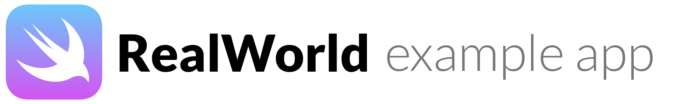

------

# ⚠️ Caution!!

This application is solving the following problems: 
* When an API with optional authentication is called several times, the following error is output on [this line](https://github.com/iq3addLi/swift-vapor-layered-realworld-example-app/blob/0.9.0/Sources/Presentation/Middleware/AuthenticateOptionalMiddleware.swift#L24) and crashes.

```bash
realworld(50355,0x700001305000) malloc: Double free of object 0x102c9cab0
realworld(50355,0x700001305000) malloc: *** set a breakpoint in malloc_error_break to debug
```

Please wait for a while until the release.  👷‍♂️👷‍♀️

------

[](http://realworld.io)  [](https://github.com/vapor/vapor)  [](https://swift.org)  [](https://iq3addli.github.io/swift-vapor-layered-realworld-example-app/)

# 

> ### Vapor codebase containing real world examples (CRUD, auth, advanced patterns, etc) that adheres to the [RealWorld](https://github.com/gothinkster/realworld) spec and API.

[Demo](https://github.com/gothinkster/realworld)&nbsp;&nbsp;&nbsp;&nbsp;[RealWorld](https://github.com/gothinkster/realworld) 


This codebase was created to demonstrate a fully fledged fullstack application built with **Vapor** including CRUD operations, authentication, routing, pagination, and more.

We've gone to great lengths to adhere to the **Vapor** community styleguides & best practices.

For more information on how to this works with other frontends/backends, head over to the [RealWorld](https://github.com/gothinkster/realworld) repo.

[toc]

# How it works

## On local

### Precondition

* Your platform is Linux or Mac.
* Swift 5.1.1 or over than is installed.
* Docker is installed.

### Build RealWorld App

```bash
$ swift build -c release 
```

### Launch container of MySQL

```bash
$ docker-compose up
```

### Set environments for MySQL

```bash
$ export MYSQL_HOSTNAME=0.0.0.0
$ export MYSQL_USERNAME=mysqluser
$ export MYSQL_PASSWORD=mysqlpass
$ export MYSQL_DATABASE=mysqldatabase
```

This setting values is editable, but it needs to match the setting in [docker-compose.yml](./docker-compose.yml).

### Launch RealWorld App 

```bash
$ .build/release/realworld serve --hostname 0.0.0.0 --port 8080
```

### Stop servers

By `Control + C` on launched terminal. Will stop MySQL and App.


## On local container (For non-Mac)

### Precondition

* Docker is installed.

### Build container for RealWorld App

```bash
$ docker build -t realworld:latest .
```

### Set environments for MySQL

```bash
$ export MYSQL_USERNAME=mysqluser
$ export MYSQL_PASSWORD=mysqlpass
$ export MYSQL_DATABASE=mysqldatabase
$ export MYSQL_ROOTPASS=rootpass
```

This setting values is editable.  Note that the value set at the beginning is recorded. 

### Launch container of MySQL

```bash
$ docker run \
  --rm \
  -e MYSQL_USER=${MYSQL_USERNAME}\
  -e MYSQL_PASSWORD=${MYSQL_PASSWORD}\
  -e MYSQL_DATABASE=${MYSQL_DATABASE}\
  -e MYSQL_ROOT_PASSWORD=${MYSQL_ROOTPASS}\
  -v ${PWD}/mysql_data:/var/lib/mysql \
  -p 3306:3306 \
  mysql:5.7
```

### Check MySQL address in bridge network on docker

```bash
$ docker network inspect bridge | grep IPv4Address
                "IPv4Address": "172.17.0.2/16", // example
```

### Launch container of RealWorld App 

```bash
$ docker run \
  --rm \
  -p 8080:80 \
  -e MYSQL_HOSTNAME=<<host part of MySQL address>>\
  -e MYSQL_USERNAME=${MYSQL_USERNAME}\
  -e MYSQL_PASSWORD=${MYSQL_PASSWORD}\
  -e MYSQL_DATABASE=${MYSQL_DATABASE}\/
  realworld:latest
```

`Server starting on http://0.0.0.0:80`  is displayed. But it opens at http://0.0.0.0:8080 .

### Stop containers

```bash
$ docker ps
$ docker stop <<IMAGE ID for MySQL>> <<IMAGE ID for RealWorld App>>
```


## On AWS Fargate by pulumi

### Precondition

* You have AWS and pulumi account.
* AWS and Pulumi CLI is Installed.

### Set environments for AWS CLI

```bash
$ set +o history # disable record to bash_history 
$ export AWS_ACCESS_KEY_ID=<<Your access key id of AWS account>>
$ export AWS_SECRET_ACCESS_KEY=<<Your access key secret of AWS account>>
$ set -o history
$ clear # flush terminal
```

### Preview pulumi stack

```bash
$ cd pulumi
$ pulumi preview
```

### Deploying pulumi stack

```bash
$ pulumi up --yes
```
In this case, the connection settings is listed in [pulumi/Pulumi.dev.yaml](pulumi/Pulumi.dev.yaml). 

When processing is complete, the host names for MySQL and APP will be displayed. 

```bash
Outputs:
    appHost  : "svlre-app-listener-*.us-east-1.elb.amazonaws.com"
    mysqlHost: "svlre-mysql-listener-*.elb.us-east-1.amazonaws.com"
```

Everyone using AWS. I think you know well. **Launched resources are expensive💸**. Clean up resources when you are done.

### Clean up pulumi stack

```bash
$ pulumi destroy --yes
```

⚠️ MySQL storage is volatile.


# Getting started

> *Now writing ...*

